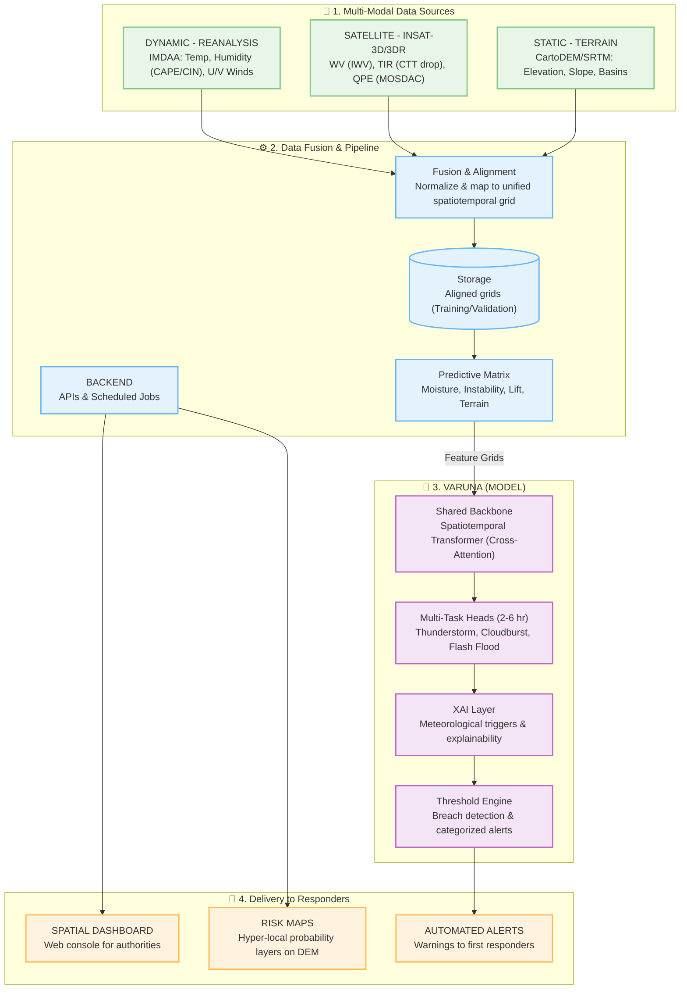

# VARUNA AI: Hyper-Local Early Warning System 🌩️🚨

**VARUNA AI** is an AI-driven, hyper-local early warning system designed for the **nowcasting (2-6 hours)** of severe thunderstorms, cloudbursts, and flash floods. Built for the India Meteorological Department (IMD) and disaster management authorities, VARUNA AI fuses multi-modal meteorological data through a Hybrid Spatiotemporal TransUNet architecture to deliver highly accurate, actionable, and explainable risk assessments.

---

## 🏗️ System Architecture

The architecture is divided into four main pillars: Data Sources, Pipeline, the VARUNA Model, and Delivery.



---

## 🌟 Key Features

- **Multi-Modal Data Fusion**: Assimilates 30+ atmospheric variables from IMDAA, 4-channel INSAT-3D satellite imagery, and high-resolution SRTM DEM terrain data.
- **Hybrid TransUNet Architecture**: Utilizes 3D temporal compression, a shared CNN-Transformer bottleneck with Multi-Head Self-Attention for global receptive awareness, and independent multi-task U-Net decoders.
- **Explainable AI (XAI)**: Demystifies model predictions by breaking down alerts into readable meteorological triggers (e.g., CAPE threshold breaches, rapid CTT drops).
- **Official SOP Reporting**: Automatically generates standard operating procedure (SOP) compliant PDF bulletins for NDMA, SDMA, and District Collectors based on live tensor outputs.
- **Geospatial Risk Mapping**: Real-time rendering of extreme risk probabilities overlaid directly onto MapLibre GL JS mapping engines with district-level zonal boundary detection.

---

## 🛠️ Technology Stack

### Frontend (User Interface)
- **Framework**: React.js with Vite
- **Styling**: Tailwind CSS, Lucide Icons
- **State Management**: Zustand
- **Mapping Engine**: MapLibre GL JS, Deck.gl (BitmapLayer, GeoJsonLayer)
- **Routing**: React Router DOM

### Backend (API & Orchestration)
- **Framework**: FastAPI (Python)
- **Geospatial Processing**: Rasterio, Rasterstats, SciPy (Gaussian smoothing)
- **Concurrency**: Threading locks for safe parallel inference

### Deep Learning Model
- **Framework**: PyTorch
- **Architecture**: Hybrid TransUNet (3D Convolutions + Vision Transformer + U-Net Decoders)
- **Pre-trained Artifacts**: `sample_inference_data.pt`

---

## 🚀 Getting Started

### Prerequisites
- Node.js (v18+)
- Python (3.9+)

### 1. Backend Setup
Navigate to the `backend` directory, set up your virtual environment, and start the FastAPI server:
```bash
cd backend
python -m venv venv
.\venv\Scripts\activate  # On Windows
pip install -r requirements.txt
python -m uvicorn app.main:app --reload
```
The backend API will run on `http://localhost:8000`.

### 2. Frontend Setup
Navigate to the `frontend` directory, install dependencies, and start the Vite dev server:
```bash
cd frontend
npm install
npm run dev
```
The application will be accessible at `http://localhost:3000`.

---

## 📡 Data Sources
VARUNA AI relies on the following active telemetry and static datasets:
1. **INSAT-3D/3DR Satellite**: Water Vapor (WV), Thermal Infrared (TIR), and QPE.
2. **IMDAA High-Res Reanalysis**: Temperature profiles, CAPE/CIN, U/V winds.
3. **Doppler Weather Radar (DWR)**: Real-time high-resolution precipitation tracking.
4. **Automated Rain Gauge (ARG)**: Ground truth validation and real-time river telemetry.
5. **SRTM Digital Elevation Model**: Static terrain, elevation, slope, and drainage basins.

---
*Developed for SIH 2026 - Problem Statement #77 (MoES/IMD)*
